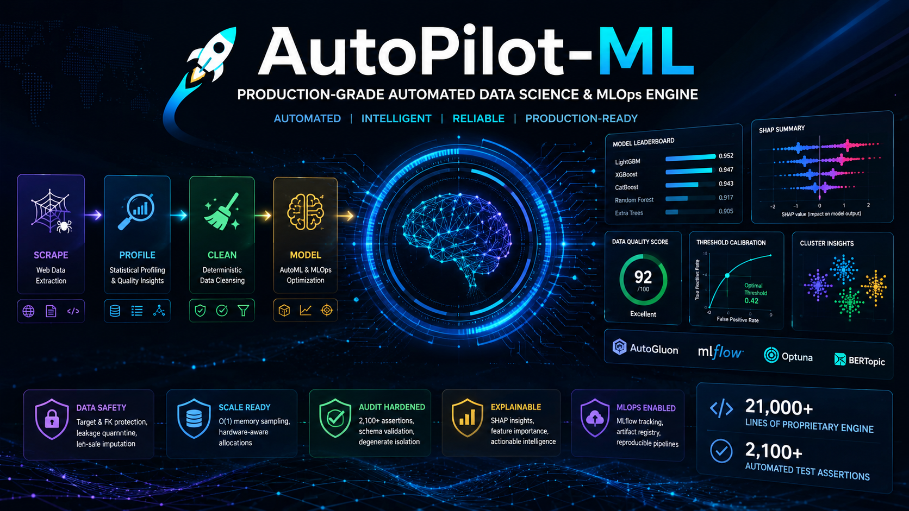

<p align="center">
  <h1 align="center">🚀 AutoPilot-ML</h1>
  <p align="center">
    <strong>Production-Grade Automated Data Science & MLOps Engine</strong><br/>
    <em>Proprietary, enterprise-grade automated modeling and pipeline suite with interactive tutorial showcases.</em>
  </p>
  <p align="center">
    
    
    
    
    
  </p>
  <br/>
  
</p>

---

## 🌟 Executive Summary

**AutoPilot-ML** is a modular, enterprise-grade data science automation suite designed to execute the entire data lifecycle — from raw web data extraction to production-ready predictive models. The architecture separates the highly optimized, proprietary core engines from the public API layer, presenting a clean interface for data scientists, ML engineers, and technical stakeholders.

The public interface is showcased through interactive Jupyter Notebooks, demonstrating the capabilities of the automated engines in data ingestion, deep statistical profiling, deterministic data cleansing, and multi-domain model optimization.

| User Role | Ecosystem Deliverables |
|---|---|
| **🔬 Data Scientist** | Unified AutoML execution with Optuna hyperparameter tuning, SHAP explainability matrices, and MLflow experiment tracking across 4 machine learning domains. |
| **📊 Business Analyst** | Interactive HTML dashboards, auto-generated Entity-Relationship diagrams, and plain-language data quality action plans. |
| **🤖 ML Engineer** | Deterministic, reproducible pipelines with memory-safe O(1) sampling, hardware-aware resource allocation, and exportable model artifacts. |

> **📐 System Capacity:** Powered by a proprietary engine comprising ~21,000 lines of highly optimized code, validated by a rigorous 2,100+ line automated test specification matrix to ensure production stability.

---

## ✨ Headline Features

### 🧠 Automated Insight Generation
The statistical profiling engine translates complex numerical metrics into human-readable, actionable recommendations. It automatically compiles an **LLM-ready Markdown context file** mapping the schema:

- 🔗 **Auto-detected Entity Relationships** visualized as Mermaid ER diagrams.
- 📏 **Data Quality Scores** (0–100) based on completeness, uniqueness, and semantic type consistency.
- 🎯 **Prioritized Action Plans** classifying quality warnings by severity (CRITICAL / WARNING / INFO) per column.
- 🧩 **Semantic Type Inference** distinguishing ZIP codes, hash-IDs, coordinates, and ordinals from generic numeric types.

### 📊 Premium Visual Dashboards
Each module generates a dark-themed, responsive HTML dashboard embedded directly inside Jupyter Notebooks or saved as standalone HTML assets:
- Model performance leaderboards with metric card visualizations.
- SHAP explainability matrices and feature importance heatmaps.
- Binary classification decision threshold calibration curves.
- Step-by-step cleaning audit logs and execution timelines.
- Unsupervised cluster archetype profiles with comparisons to global distributions.

### 🛡️ Production-Grade Safety
A defensive engineering layer protects pipelines against silent data corruption:

| Protection | MLOps Safety Safeguard |
|---|---|
| **Target Variable Shielding** | Labels are protected from imputation, clipping, or transforms to preserve ground truth. |
| **Foreign Key Protection** | Join keys are blocked from statistical coercion, imputation, or encoding to maintain relational integrity. |
| **O(1) Memory Sampling** | High-cardinality operations (MICE/KNN imputation, multicollinearity checks) automatically use bounded sampling budgets to prevent OOM errors. |
| **Temporal Leakage Quarantine** | Features recorded after the target anchor timestamp are quarantined to prevent leakage. |
| **Inf-Safe Imputation** | Upstream infinite values (`np.inf`) are neutralized before computing descriptive statistics. |
| **Hardware-Aware Allocations** | Resources are dynamically throttled based on system CPU/GPU/RAM availability to avoid local execution failure. |

### Audit-Hardened Safeguards
The pipeline contains strict enforcement rules:
- **Extension-aware loading**: Path verification for CSV, Excel, JSON, and Parquet files prior to execution.
- **Input Validation**: Strict schema checks for holdout size, forecast horizons, URLs, selector methods, and crawler timing parameters.
- **Degenerate Input Isolation**: Safely handles tiny, empty, constant, or non-finite datasets in modeling and visualization tasks.
- **Batch Inference Schema Verifications**: Prevents inference on mismatched schemas or missing features during batch scoring.
- **Context Sanity**: Generates aggregate-only AI summaries and falls back to local narrative generation if network-based API endpoints are unavailable.

### 🔗 Modular Pipeline Architecture
The execution steps feed into one another sequentially, though each module can be executed standalone:

```
🕷️ Scrape  ──→  🔍 Profile  ──→  🧹 Clean  ──→  🤖 Model
     │               │               │              │
     ▼               ▼               ▼              ▼
  Raw HTML       Quality Report   ML-Ready Data   Trained Models
  → CSV/JSONL    → Action Plan    → Cleaned CSV   → Predictions
                 → Mermaid ERD                     → HTML Dashboard
                 → LLM Context                     → MLflow Artifacts
```

---

## 🗺️ Ecosystem Architecture & Public API Layer

AutoPilot-ML is structured with a strict decoupling between the high-performance proprietary engine backend and the user-facing execution wrapper. This allows stakeholders to inspect the workflow, configure parameters, and review predictions via standard Jupyter interfaces while maintaining a clean abstraction.

### Interactive Notebook Showcase

The primary entry points for exploring the capabilities of the system are the interactive notebooks:

| Interactive Notebook | Direct Render | Showcase Domain | Target Operations |
|---|---|---|---|
| [`data_scraper.ipynb`](data_scraper.ipynb) | [⚡ View on nbviewer](https://nbviewer.org/github/Rakishu02/AutoPilot-ML/blob/main/data_scraper.ipynb) | Data Ingestion | Stealth async web scraping and subprocess isolation. |
| [`data_profiler.ipynb`](data_profiler.ipynb) | [⚡ View on nbviewer](https://nbviewer.org/github/Rakishu02/AutoPilot-ML/blob/main/data_profiler.ipynb) | Statistical Profiling | Semantic type detection, quality score calculations, and ERD generation. |
| [`data_cleaner.ipynb`](data_cleaner.ipynb) | [⚡ View on nbviewer](https://nbviewer.org/github/Rakishu02/AutoPilot-ML/blob/main/data_cleaner.ipynb) | Deterministic Cleaning | 12-step sequential data repair, outlier treatment, and imputation. |
| [`ml_tabular.ipynb`](ml_tabular.ipynb) | [⚡ View on nbviewer](https://nbviewer.org/github/Rakishu02/AutoPilot-ML/blob/main/ml_tabular.ipynb) | Tabular AutoML | Supervised classification, regression, multi-label models, and SHAP explainability. |
| [`ml_nlp.ipynb`](ml_nlp.ipynb) | [⚡ View on nbviewer](https://nbviewer.org/github/Rakishu02/AutoPilot-ML/blob/main/ml_nlp.ipynb) | NLP Engines | Supervised intent classification, zero-shot routing, and unsupervised topic discovery. |
| [`ml_timeseries.ipynb`](ml_timeseries.ipynb) | [⚡ View on nbviewer](https://nbviewer.org/github/Rakishu02/AutoPilot-ML/blob/main/ml_timeseries.ipynb) | Time Series Forecasting | Multi-item forecasting, quantile uncertainty bounds, and automated covariate enrichment. |
| [`ml_clustering.ipynb`](ml_clustering.ipynb) | [⚡ View on nbviewer](https://nbviewer.org/github/Rakishu02/AutoPilot-ML/blob/main/ml_clustering.ipynb) | Unsupervised Discovery | MiniBatch K-Means, HDBSCAN, UMAP/PCA dimensionality reductions, and archetype profiling. |

### Output Artifact Structure

When the pipeline runs, it generates structured artifact directories within the local workspace:

```
📦 Workspace Output/
├── cleaned_dataset/          ← Cleaned CSV datasets from the Data Cleaning Engine
├── Exports/                  ← Extracted data files from the Data Scraper
└── automl_run/               ← Outputs from the AutoML Engine
    ├── models/               ← Trained model artifacts (serialized models, weights)
    ├── models_nlp/           ← NLP models (Transformers, BERTopic, BGE-M3)
    ├── models_multilabel/    ← Multilabel classifier outputs
    ├── models_ts/            ← TimeSeries predictor models
    ├── plots/                ← Metric charts and visual dashboards
    ├── predictions/          ← Inference outputs and cluster profiles
    └── mlruns/               ← MLflow tracking repositories
```

---

## 🤖 The ML Engine — Multi-Domain Modeling Suite

The proprietary ML Engine is accessed via the high-level `AutoMLFactory` interface. It routes execution to one of four ML domains based on the configuration:

### 📋 Tabular Domain (Classification / Regression / Multi-Label)
*Powered by the **AutoGluon v1.5 infrastructure**, with model presets ranging from `medium` to `extreme`.*
- **Ensembled Prototyping**: Automates multi-model training, stacked ensembling, and foundation models (e.g., TabPFN, TabICL) on the highest presets.
- **Class Imbalance Correction**: Integrates synthetic over-sampling techniques (SMOTE) and cost-sensitive objective functions to handle highly imbalanced datasets.
- **Hyperparameter Optimization**: Runs Optuna hyperparameter tuning to find optimal model weights.
- **SHAP Explainability**: Generates SHAP explainability matrices and feature importance rankings with automated sampling controls.
- **Threshold Calibration**: Calibrates decision thresholds on binary targets to optimize for specific MLOps targets (F1, precision, or recall).

### 📈 Time Series Domain (Probabilistic Forecasting)
- **Multi-Item Optimization**: Handles parallel forecasting for thousands of time-series items with static features.
- **Quantile Forecasting**: Generates uncertainty-aware predictions (e.g., quantiles `[0.05, 0.5, 0.95]`).
- **Automated Covariates**: Enriches inputs with localized country holiday calendars and temporal indicators (e.g., `is_weekend`).
- **Temporal Alignment**: Automatic frequency inference and backtesting walk-forward validation splits.

### 💬 NLP Domain (Supervised, Zero-Shot, & Unsupervised Modes)
- **Supervised Classification**: Deep learning models optimized for text classification.
- **Zero-Shot Routing**: Uses DeBERTa models to route text records to dynamic candidate classes without labeled training data, auto-accepting high-confidence labels and flagging low-confidence rows.
- **Unsupervised Topic Discovery**: Integrates **BERTopic NLP architectures** using dense BGE-M3 text embeddings.
- **Semantic Labeling**: Utilizes LLMs (such as Google Gemini) to generate readable topic names, with c-TF-IDF keyword summaries as a deterministic local fallback.

### 🔮 Clustering Domain (Unsupervised Discovery)
- **Algorithm Swapping**: Trains and benchmarks MiniBatch K-Means, HDBSCAN, and Agglomerative Clustering simultaneously.
- **Auto-K Selection**: Sweep parameters from $K=2$ to configured limit using Silhouette, Davies-Bouldin, and Calinski-Harabasz criteria.
- **Dimensionality Reduction**: Performs **UMAP/PCA dimensionality reductions** to compress features while retaining topological structure.
- **Inference Proxies**: Saves a trained K-Nearest-Neighbors model alongside the clustering outputs, allowing real-time cluster assignments for new streaming data points.

---

## 🔍 The Data Profiler — Schema & Relationship Discovery

The statistical profiling module analyzes data schemas beyond simple summaries:
- **Semantic Auto-Detection**: Maps fields into 9 semantic types (such as `coordinate_like`, `hash_like`, `identifier_like`) to handle IDs and keys correctly.
- **Quality Scorecard**: Combines completeness, uniqueness, and consistency into a single weighted score.
- **Dirty Placeholder Identification**: Finds string null-tokens like `"n/a"`, `"?"`, or `"unknown"`.
- **Multicollinearity Checks**: Scrapes high-correlation feature pairs using memory-safe bounded sampling.
- **Multi-File Entity Relations**: When run across multiple datasets, it auto-detects shared keys and outputs a complete Mermaid Entity-Relationship diagram.

---

## 🧹 The Data Cleaner — 12-Step Deterministic Pipeline

The data cleaning pipeline executes a rigid, sequential set of transformations to prepare raw data for downstream modeling:

```
┌─────────────────────────────────────────────────────────────────┐
│ Step  1: Drop Columns ──→ Remove high-missingness/redundant     │
│ Step  2: Deduplicate ──→ Enforce row uniqueness (first/last)    │
│ Step 2b: Leakage Handling ──→ Prune temporal look-ahead cols    │
│ Step  3: Datetime Conversions ──→ Parse strings to datetime64   │
│ Step  4: Coercion Cleansing ──→ Force mixed-type to numeric     │
│ Step 4b: Value Mapping ──→ Replace dirty tokens / null aliases  │
│ Step  5: Text Cleaning ──→ Unicode normalize, strip, lowercase  │
│ Step  6: Imputation ──→ Median/Mode, KNN, or MICE repair        │
│ Step  7: Cardinality Grouping ──→ Entropy-based rare-label      │
│ Step  8: Transforms ──→ Log1p, Box-Cox, Yeo-Johnson             │
│ Step  9: Outlier Treatment ──→ IQR / MAD / Winsorization        │
│ Step 10: Categorical Association ──→ Prune redundant classes    │
│ Step 11: Multicollinearity ──→ Spearman ρ pairwise pruning      │
│ Step 12: Memory Optimization ──→ Downcast dtypes to save RAM    │
└─────────────────────────────────────────────────────────────────┘
```

### Advanced Imputation Modes

The cleaner automatically selects or falls back between three imputation methods depending on the column type and memory footprint:

| Imputation Level | Method | Best Use Case |
|---|---|---|
| **Simple Imputation** | Mean, Median, Mode, or Constant values | Fast baseline correction |
| **KNN Imputation** | K-Nearest Neighbors regression imputer | Locally correlated numerical features |
| **MICE Imputation** | Multiple Imputation by Chained Equations | Highly correlated multi-variable missingness |

If the data footprint exceeds hardware bounds, advanced imputers automatically degrade to simple statistics, recording an audit event to prevent OOM errors.

---

## 🕷️ The Data Scraper — Async & Stealth Ingestion

The web scraping system manages async, isolated data ingestion pipelines:
- **Subprocess Isolation**: Spawns async scrape sessions outside the primary event loop to avoid Tornado crashes in Jupyter environments.
- **Stealth Evasion**: Uses anti-bot bypass mechanisms to evade simple web scrapers blocks (dynamic user agents, header shuffling).
- **Rate-Limiting Controls**: Configurable request timeouts, request delays (jitter ranges), and retries.
- **Incremental Checkpointing**: Regularly commits scraped rows to disk to ensure progress is saved if interrupted.

---

## 📖 Tutorial Showcase

The following snippets illustrate how external developers interact with the AutoPilot-ML system through the provided interface wrapper APIs.

### Step 1: Ingest Data using the Scraper Interface
Run the scraping pipeline via the Jupyter wrapper API to extract structured datasets from raw web links:

```python
# Executed via the data_scraper.ipynb interface
from autopilot_ml import execute_pipeline

df = execute_pipeline(
    urls=["https://quotes.toscrape.com/"],
    container_selector=".quote",
    fields_mapping={
        "text": ".text::text",
        "author": ".author::text",
        "tags": {"selector": ".tag::text", "method": "getall"}
    },
    filename="Exports/quotes",
    export_format="csv"
)
```

### Step 2: Extract Statistical Insights
Analyze dataset health, identify target variables, and export LLM-friendly schemas:

```python
# Executed via the data_profiler.ipynb interface
from autopilot_ml import DataProfiler, GlobalProfiler

# Single-file deep profiling
profiler = DataProfiler("Dataset/orders.csv", profile_context={
    "target_cols": ["order_status"],
    "prediction_time_col": "order_purchase_timestamp"
})
profiler.profile()  # Compiles and displays interactive HTML dashboard

# Multi-file portfolio scanning
gp = GlobalProfiler(
    ["Dataset/orders.csv", "Dataset/customers.csv", "Dataset/products.csv"],
    profile_contexts={
        "orders": {"target_cols": ["order_status"], "prediction_time_col": "order_purchase_timestamp"},
        "products": {"target_cols": ["price"]}
    }
)
gp.profile_all(export_md="project_ai_context.md")  # Generates ERD and LLM documentation
```

### Step 3: Run the Deterministic Cleaner
Apply the 12-step cleaning pipeline with safety boundaries:

```python
# Executed via the data_cleaner.ipynb interface
from autopilot_ml import DataCleaner

cleaner = DataCleaner(
    df,
    dataset_name="orders",
    columns_to_drop=["review_comment_title"],
    duplicate_strategy="keep_first",
    leakage_rules={"drop_cols": ["order_status"]},
    datetime_conversions={"order_date": {"format": "auto"}},
    coercion_rules={"price": {"target": "numeric", "strip_currency": True}},
    text_cleaning=["customer_city"],
    imputation_rules={
        "price": {"strategy": "simple", "method": "median"},
        "weight": {"strategy": "advanced", "method": "knn", "n_neighbors": 5}
    },
    transforms={"price": {"method": "log1p"}},
    outlier_treatment={"freight": {"method": "winsorize", "limits": [0.05, 0.05]}},
    multicollinearity_threshold=0.90,
    target_variables=["delivery_status"],  # Protected from transforms
    foreign_keys=["customer_id", "order_id"],  # Protected from statistical imputation
)

cleaned_df = cleaner.clean()
cleaner.save("cleaned_dataset")
```

### Step 4: Execute Model Training
Train, evaluate, and calibrate models across machine learning tasks:

```python
# Executed via the ml_tabular.ipynb interface
from autopilot_ml import AutoMLFactory

factory = AutoMLFactory({
    "experiment_name": "Customer_Churn",
    "task_type": "tabular",
    "dataset_path": "cleaned_dataset/cleaned_orders.csv",
    "target_column": ["churn"],
    "presets": "high",
    "time_limit_seconds": 300,
    "calibrate_decision_threshold": True,
    "eval_metrics": ["f1"],
    "base_output_dir": "automl_run",
})

factory.execute_pipeline()    # Executes AutoML pipeline, tracking runs in MLflow
factory.display_dashboard()   # Visualizes metrics & SHAP explainability inside Jupyter
```

---

## 🧪 Engine Verification & Integrity Matrix

The underlying pipeline engines are structurally validated by a rigorous, 2,100+ line automated test specification matrix. This validation layer ensures stability, enforces API contracts, and prevents regressions across edge cases.

The system's integrity verification covers:

| Verification Suite | Validated Functionality |
|---|---|
| **Architectural Boundaries** | Verifies O(1) memory shields and proactive sampling limit thresholds. |
| **Data Profiler Integrity** | Validates semantic type inference, Mermaid ERD output, and dashboard serialization. |
| **Cleaning Pipeline Verification** | Enforces chronological execution order, target variable shielding, and coercion correctness. |
| **Robustness to Dirty Inputs** | Validates handling of all-null columns, boolean masquerades, and infinite values. |
| **Winsorization & Imputation** | Tests quantile clipping precision, KNN/MICE fallback bounds, and infinite-value neutralization. |
| **Scraper Subprocess Sandbox** | Checks async execution, Cloudflare bypass session handling, and timing jitter. |
| **Tabular & Time Series AutoML** | Validates AutoGluon model routing, time-series splitting, and MLflow logging. |
| **NLP Pipeline Verification** | Validates zero-shot scoring arrays, topic probability thresholds, and Gemini fallback routines. |

---

## 📂 Repository Showcase Structure

The public repository exposes the interactive tutorial notebooks that consume the AutoPilot-ML engine:

```
📦 AutoPilot-ML
│
│── Interactive Notebook Showcase ──────────────────────────────────
├── ml_tabular.ipynb              📓 Tabular classification, regression, and threshold optimization
├── ml_nlp.ipynb                  📓 Supervised NLP, zero-shot routing, and unsupervised BERTopic
├── ml_clustering.ipynb           📓 Unsupervised clustering, UMAP/PCA, and archetype profiling
├── ml_timeseries.ipynb           📓 Probabilistic time-series forecasting & covariates
├── data_scraper.ipynb            📓 Async stealth web scraping & pipeline wrappers
├── data_cleaner.ipynb            📓 Deterministic 12-step cleaning pipeline and imputer options
├── data_profiler.ipynb           📓 Statistical data profiling, ERD output, & LLM context
│
│── Project Documentation ──────────────────────────────────────────
├── README.md                     📄 Showcase documentation & system reference
│
│── Workspace Artifacts (Gitignored) ────────────────────────────────
├── Dataset/                      📁 Local source datasets
├── cleaned_dataset/              📁 Cleaned output datasets
├── Exports/                      📁 Raw web scraped outputs
└── automl_run/                   📁 Saved models, SHAP charts, MLflow trackers
```

---

## 🔧 High-Level Interface Configuration Schema

The system behavior is managed via runtime config dictionaries parsed by the wrapper classes:

### AutoMLFactory Schema

| Parameter | Type | Default | Description |
|---|---|---|---|
| `experiment_name` | `str` | `"AutoML_..."` | MLflow experiment tag |
| `task_type` | `str` | *required* | Routing target: `"tabular"`, `"time_series"`, `"nlp"`, or `"clustering"` |
| `dataset_path` | `str` | *required* | File path to cleaned CSV dataset |
| `target_column` | `List[str]` | *required* | Column label(s) containing target values |
| `presets` | `str` | `"medium"` | Quality preset: `"extreme"` · `"best"` · `"high"` · `"medium"` |
| `time_limit_seconds` | `int` | `60` | Execution time limit in seconds |
| `eval_metrics` | `List[str]` | `[]` | Optimization metric arrays |
| `is_multilabel` | `bool` | `False` | Enable multi-label tabular models |
| `calibrate_decision_threshold` | `bool` | `False` | Apply threshold optimization on binary tasks |
| `low_resource_mode` | `str | bool` | `False` | System resource profiling (`"auto"`, `True`, or `False`) |
| `enable_ai_summary` | `bool` | `True` | Include optional automated AI summary audit inside dashboards |

*(For domain-specific schema options, refer to the individual interactive notebooks.)*

---

## 📜 Proprietary Distribution & Licensing

This showcase repository contains the public tutorial layer for demonstrating pipeline execution, visualization, and validation. The underlying core execution engines and styling libraries are proprietary intellectual property.

For commercial inquiries or system customization requests, please contact the repository administrator.

---

<p align="center">
  <strong>Engineered to deliver enterprise-grade automation for high-impact machine learning workflows.</strong>
</p>
